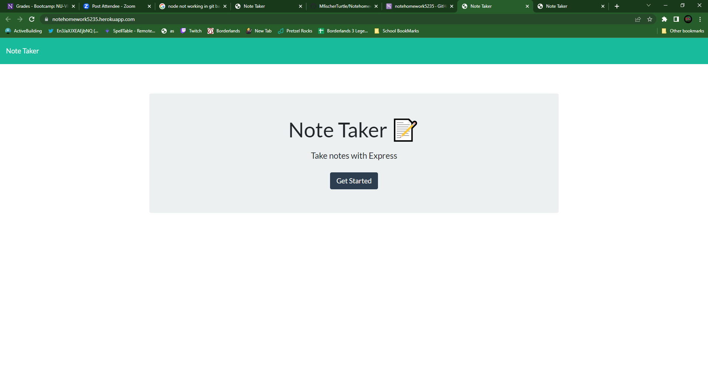
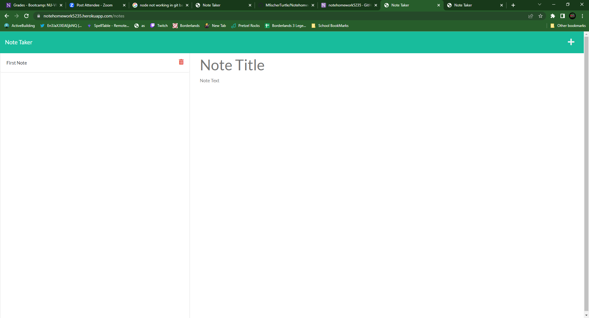
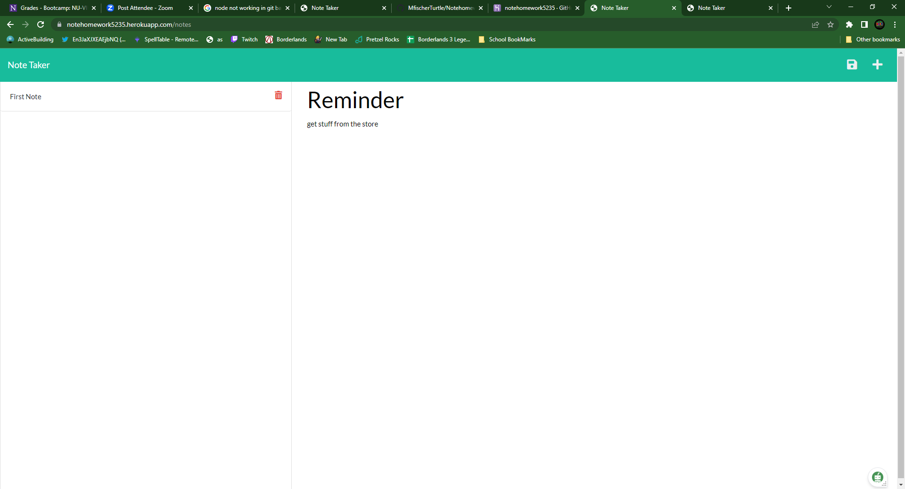
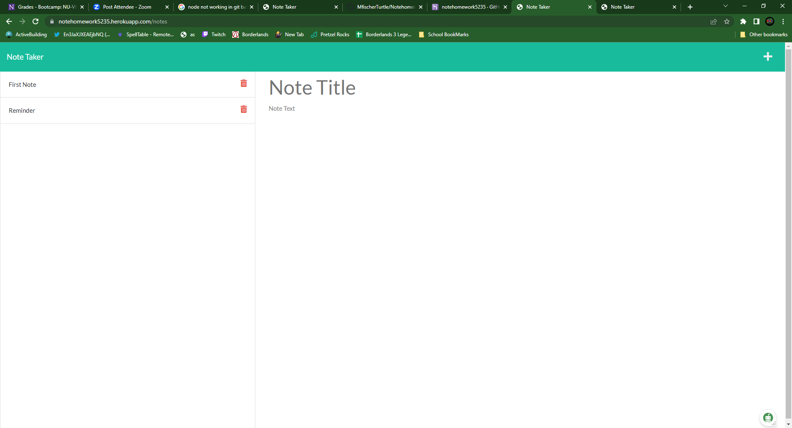
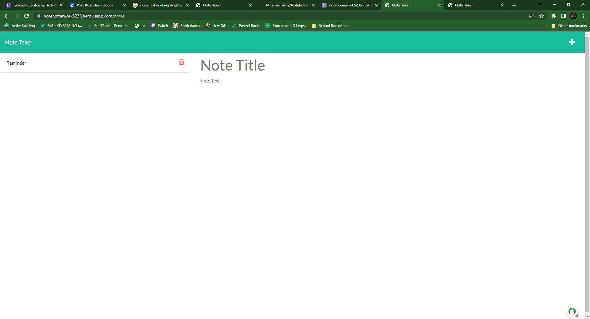
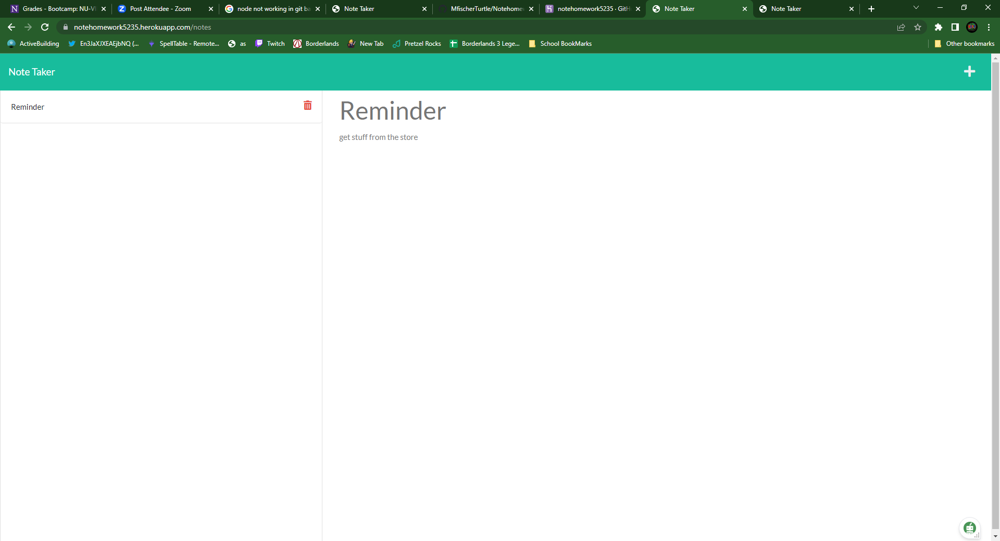

# Notehomework  
  ## Description
  This app is used to keep a detailed notes in a local server to call back to later 
  ## Table of Contents
* [Installation](#installation)
* [Link](#link)
* [Usage](#usage)
* [Pictures](#pictures)
* [Questions](#questions)
* [Credits](#credits)
## Link
[Notehomework](https://notehomework5235.herokuapp.com/)
## Installation
  express

## Usage
  1st make a title for your note then type out the note after making the title you can not save a note without have a title and text with the note then if needed you can delete the note after you are done with it

## Pictures

## Questions
  Email me at:
  <M.rfischer5235@gmail.com>

  
 